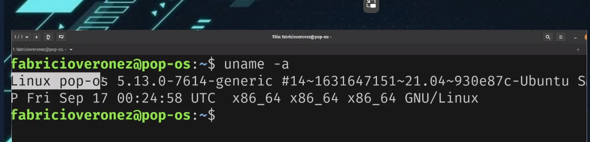

# Linux 

## Comandos linux

### Comandos básicos

#### `uname -a` 
  - Serve para mostrar todos os dados do seu sistema 
##### Ex:
    

### Comandos para arquivos e diretórios 

#### `cp <nome do arquivo> <pasta de destino e nome do arquivo>` 
  - Serve para copiar arquivo de um diretório para putro  
#### `mv <nome do arquivo> <pasta de destino e nome do arquivo>` 
  - Serve para mover arquivo de um diretório para putro e tambem renomear arquivos 
#### `grep -n <palavra> <nome do arquivo>` 
  - Serve para identificar alguma palavra dentro de algum arquivo 
  - Flag `-i` serve apra deixar ele case sensitive

### Execução de comando 

- stdout e stderr
#### `|` 

- Serve para juntar comando no linux 
- Ex: `Ls -l | grep error`

#### `>` 

- Serve para manipular a saida padrão de comandos linux
- Ex: `Ls -l > saida.txt`

#### `>>` 

- Serve para manipular a saida padrão de comandos linux concatenando com o que tem no arquivo selecionado
- Ex: `Ls -l > saida.txt`
  - para manipular a saida de um erro utilize `2>`

## Pontos de Montagem

## Gerenciamentos de pacotes 

### `dpkg -i <pacote.deb>`
  - Para instalar um pacote 
### `dpkg -r <nome do app>`
  - Para desinstalar
### `apt search`
  - Procurar pacotes 

## Gerenciamento de processos
### `ps -aux`
- Lista os processos 
### `kill`
- Pega o id do processo e passa apos o kill para matar o mesmo 
### `top`
- Visuliza processos 
  - Tem um tal de htop que serve para isso tmb 

## Acesso emoto SSH 
- É possivel acesssar de duas maneiras 
  - Usuario e senha 
  - Par de chaves
### usuariuo e senha 
`ssh <usuario do sistema>@<ipdamaquina>` 

#### Gerando chave ssh 
`ssh-keygen -t rsa -b 2048`
- A chave vai ser encontrada dentro da pasta ssh 